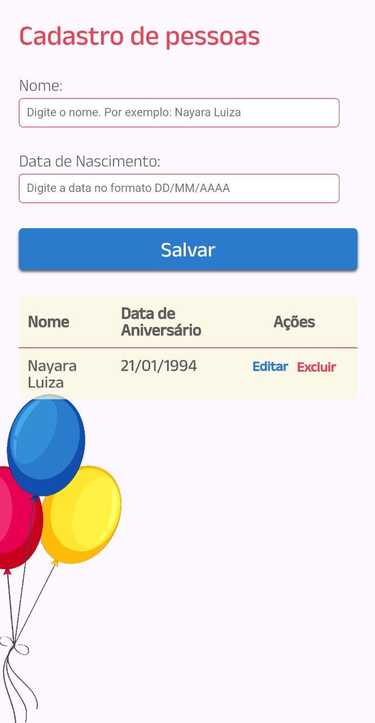
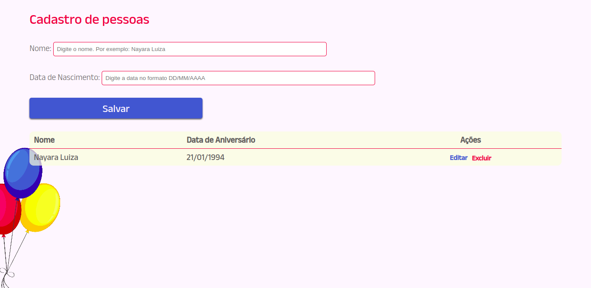

# JavaScript e DOM | CRUD

### Tópicos

- [Descrição do projeto](#descrição-do-projeto)
    - [Processo de desenvolvimento](#processo-de-desenvolvimento)
    - [Screenshot](#screenshot)
    - [Mobile](#mobile)
    - [Desktop](#desktop)
- [Status do projeto](#status-do-projeto)
- [Linguagens utilizadas](#linguagens-utilizadas) 
- [Acesso ao projeto](#acesso-ao-projeto)
- [Links úteis](#links-úteis)
- [Autora](#autora)

## Descrição do projeto

Resolução do desafio [7 days of code](https://7daysofcode.io/) sobre JavaScript e DOM que consiste em criar um calendário de aniversários com CRUD básico. 
CRUD é o acrônimo para Create (criar), Read (ler), Update (atualizar) e Delete (apagar). São as quatro operações básicas de armazenamento persistente.

### Processo de Desenvolvimento
A partir desse desafio estou treinando: 
* CRUD;
* Utilizar o localStorage para armazenar de dados.

## Screenshot 

### Mobile

  

### Desktop

## Status do Projeto
Finalizado

## Linguagens Utilizadas
* HTML;
* CSS;
* JS

## Acesso ao projeto
Você pode acessar o [código fonte do projeto](https://github.com/nalutm/seven-days-of-code/tree/main/js-dom-crud). 
Também pode acessar a [página para conferir o resultado final](https://js-dom-crud.vercel.app/).

## Links úteis 
[CRUD](https://developer.mozilla.org/pt-BR/docs/Glossary/CRUD)

## Autora
[Nayara Luiza Tavares Moraes](https://github.com/nalutm)
